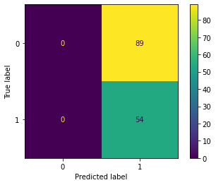

# Logistic Regression Checkpoint

This checkpoint is designed to test your understanding of the content from the Logistic Regression Cumulative Lab.

Specifically, this will cover:

* Calculating and interpreting classification metrics, particularly in the context of class imbalance
* Performing an end-to-end ML process with logistic regression
* Using NumPy and not pandas in a modeling context

## Your Task: Use Logistic Regression on the Wisconsin Breast Cancer Dataset

### Data Understanding

Here we will use the Wisconsin Breast Cancer dataset, which is available through scikit-learn ([documentation here](https://scikit-learn.org/stable/datasets/toy_dataset.html#breast-cancer-dataset)).  The goal is to predict whether a breast mass is benign or malignant based on attributes of cell nuclei in a tissue sample. Deeper understanding of the specific attributes is not required for this task.

In the cell below, we load this dataset, perform a train-test split, and scale the data for you.


```python
# Run this cell without changes
import pandas as pd
import numpy as np
from sklearn.model_selection import train_test_split
from sklearn.preprocessing import StandardScaler

# Load data
df = pd.read_csv('breast_cancer.csv')
# Seperate features from target
X, y = df.iloc[:,:-1].to_numpy(), df.iloc[:,-1].to_numpy()
# Perform train test split
X_train, X_test, y_train, y_test = train_test_split(X, y, random_state=42)
# Scale data
scaler = StandardScaler()
X_train_scaled = scaler.fit_transform(X_train)
X_test_scaled = scaler.transform(X_test)
```

### 1. Baseline Metrics

Before we actually perform any modeling, let's determine what metrics we would expect to get with a "dummy" model that always predicts the positive class.

For this assessment we'll define "negative" as a 0 (benign) and "positive" as a 1 (malignant).

We will focus on the test data, since this is what we will use to evaluate our actual model as well.

The code below shows an array containing the number of records in the test dataset with class 0 (benign) and class 1 (malignant)


```python
# Run this cell without changes
np.bincount(y_test)
```


    array([89, 54])


In other words, a model that always predicts the positive class, will predict a 1 for every observation. Given the imbalance of the target seen above, (The balance is similar in the training data as well), we will calculate different classification metrics to evaluate the model's performance for both positive and negative labels.

The confusion matrix looks like this:


```python
# Run this cell without changes
from sklearn.metrics import plot_confusion_matrix
from sklearn.dummy import DummyClassifier

plot_confusion_matrix(DummyClassifier(strategy='constant', constant=1).fit(X_train, y_train), X_test, y_test);
```


    

    


For each of the following questions, assume that a "baseline" metric means the metric we would find if our model always chose class 1.

You can just use the numbers 89 and 54 in your answer; you don't need to use `y_test` directly.

#### What is the baseline accuracy?


```python
# CodeGrade step1.1
# Replace None with appropriate code
baseline_accuracy = None
```


```python
# baseline_accuracy should be a number between 0 and 1
assert 0.0 <= baseline_accuracy and baseline_accuracy <= 1.0
```

#### What is the baseline recall?

As a reminder, a "negative" prediction is represented as 0 (benign) and a "positive" prediction as 1 (malignant). So all baseline predictions will be either "true positives" (actually 1, predicted 1) or "false positives" (actually 0, predicted 1) and there will not be any "true negatives" or "false negatives" because this model always chooses 1.


```python
# CodeGrade step1.2
# Replace None with appropriate code
baseline_recall = None
```


```python
# baseline_recall should be a number between 0 and 1
assert 0.0 <= baseline_recall and baseline_recall <= 1.0
```

#### What is the baseline precision?


```python
# CodeGrade step1.3
# Replace None with appropriate code
baseline_precision = None
```


```python
# baseline_precision should be a number between 0 and 1
assert 0.0 <= baseline_precision and baseline_precision <= 1.0
```

#### What is the baseline f1-score?


```python
# CodeGrade step1.4
# Replace None with appropriate code
baseline_f1 = None
```


```python
# baseline_f1 should be a number between 0 and 1
assert 0.0 <= baseline_f1 and baseline_f1 <= 1.0
```

## 2. Instantiate and Fit a `LogisticRegression` Model

Use the `LogisticRegression` model from scikit-learn ([documentation here](https://scikit-learn.org/stable/modules/generated/sklearn.linear_model.LogisticRegression.html)). Specify a `random_state` of 42 but otherwise use default hyperparameters.

Because logistic regression applies regularization by default, make sure you use the scaled training data to fit the model.

Call this model `model`.

We have also included code to display the confusion matrix on the training data; if the confusion matrix doesn't render, that indicates that something is incorrect about your model.


```python
# CodeGrade step2
# Replace None with appropriate code

# Import the relevant class
None

# Instantiate the model
model = None

# Fit the model on the scaled data
None

plot_confusion_matrix(model, X_train_scaled, y_train);
```


```python
# model should be a LogisticRegression
assert type(model) == LogisticRegression

# model should be fitted
assert type(model.coef_) == np.ndarray
```

### 3. Use Cross-Validation to Evaluate the Fitted Model

Use `cross_val_score` from scikit-learn ([documentation here](https://scikit-learn.org/stable/modules/generated/sklearn.model_selection.cross_val_score.html)) to evaluate the expected accuracy of the fitted model, prior to using the test data.

Use a `cv` of 3 and assign the result to `cv_scores`.


```python
# CodeGrade step3
# Replace None with appropriate code

# Import the relevant function
None

# Perform cross-validation
cv_scores = None
```


```python
# cv_scores should contain 3 scores. If it doesn't, double-check
# the value passed in for cv
assert len(cv_scores) == 3
```

### 4. Compare Baseline and Fitted Model Scores

Now, use functions from scikit-learn to compute the accuracy, recall, precision, and f1-score of the fitted model. We have prepared code that will print them out side-by-side with the baseline scores.

Documentation can be found [here](https://scikit-learn.org/stable/modules/generated/sklearn.metrics.accuracy_score.html#sklearn.metrics.accuracy_score), [here](https://scikit-learn.org/stable/modules/generated/sklearn.metrics.recall_score.html#sklearn.metrics.recall_score), [here](https://scikit-learn.org/stable/modules/generated/sklearn.metrics.precision_score.html#sklearn.metrics.precision_score), and [here](https://scikit-learn.org/stable/modules/generated/sklearn.metrics.f1_score.html#sklearn.metrics.f1_score).

This time, **use the test data to calculate each metric.**


```python
# CodeGrade step4
from sklearn.metrics import accuracy_score, recall_score, precision_score, f1_score

# Replace None with appropriate code
model_accuracy = None
model_recall = None
model_precision = None
model_f1 = None
```


```python
print(f"""
Accuracy
Baseline: {baseline_accuracy:1.3f} Fitted Model: {model_accuracy:1.3f}
Recall
Baseline: {baseline_recall:1.3f} Fitted Model: {model_recall:1.3f}
Precision
Baseline: {baseline_precision:1.3f} Fitted Model: {model_precision:1.3f}
F1 Score
Baseline: {baseline_f1:1.3f} Fitted Model: {model_f1:1.3f}
""")
```

    
    Accuracy
    Baseline: 0.378 Fitted Model: 0.979
    Recall
    Baseline: 1.000 Fitted Model: 0.981
    Precision
    Baseline: 0.378 Fitted Model: 0.964
    F1 Score
    Baseline: 0.548 Fitted Model: 0.972
    


```python
# all scores should be values between 0 and 1
assert 0.0 <= model_accuracy and model_accuracy <= 1.0
assert 0.0 <= model_recall and model_recall <= 1.0
assert 0.0 <= model_precision and model_precision <= 1.0
assert 0.0 <= model_f1 and model_f1 <= 1.0
```


```python

```
