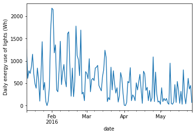
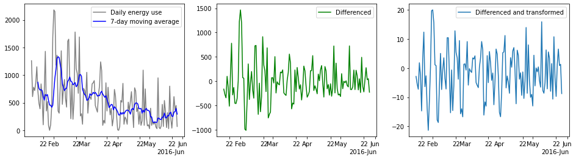

# Time Series Checkpoint

This checkpoint is designed to test your knowledge of time series analysis and modeling.

Specifically, this will cover:

* Using `pandas` to manipulate time series data
* Plotting time series data
* Modeling time series data with an ARMA model

## Data Understanding

The following dataset comes from the [UCI Machine Learning Repository](https://archive.ics.uci.edu/ml/datasets/Appliances+energy+prediction). It includes energy usage data as well as temperature and humidity data.

The relevant columns for your analysis will be:

* `date`: A string representing the timestamp of measurements taken every 10 minutes
* `lights`: An integer representing energy use of light fixtures in the house in Wh


```python
# Run this cell without changes
import pandas as pd

df = pd.read_csv("energy_data.csv")
df
```


<div>
<style scoped>
    .dataframe tbody tr th:only-of-type {
        vertical-align: middle;
    }

    .dataframe tbody tr th {
        vertical-align: top;
    }

    .dataframe thead th {
        text-align: right;
    }
</style>
<table border="1" class="dataframe">
  <thead>
    <tr style="text-align: right;">
      <th></th>
      <th>date</th>
      <th>Appliances</th>
      <th>lights</th>
      <th>T1</th>
      <th>RH_1</th>
      <th>T2</th>
      <th>RH_2</th>
      <th>T3</th>
      <th>RH_3</th>
      <th>T4</th>
      <th>...</th>
      <th>T9</th>
      <th>RH_9</th>
      <th>T_out</th>
      <th>Press_mm_hg</th>
      <th>RH_out</th>
      <th>Windspeed</th>
      <th>Visibility</th>
      <th>Tdewpoint</th>
      <th>rv1</th>
      <th>rv2</th>
    </tr>
  </thead>
  <tbody>
    <tr>
      <th>0</th>
      <td>2016-01-11 17:00:00</td>
      <td>60</td>
      <td>30</td>
      <td>19.890000</td>
      <td>47.596667</td>
      <td>19.200000</td>
      <td>44.790000</td>
      <td>19.790000</td>
      <td>44.730000</td>
      <td>19.000000</td>
      <td>...</td>
      <td>17.033333</td>
      <td>45.5300</td>
      <td>6.600000</td>
      <td>733.5</td>
      <td>92.000000</td>
      <td>7.000000</td>
      <td>63.000000</td>
      <td>5.300000</td>
      <td>13.275433</td>
      <td>13.275433</td>
    </tr>
    <tr>
      <th>1</th>
      <td>2016-01-11 17:10:00</td>
      <td>60</td>
      <td>30</td>
      <td>19.890000</td>
      <td>46.693333</td>
      <td>19.200000</td>
      <td>44.722500</td>
      <td>19.790000</td>
      <td>44.790000</td>
      <td>19.000000</td>
      <td>...</td>
      <td>17.066667</td>
      <td>45.5600</td>
      <td>6.483333</td>
      <td>733.6</td>
      <td>92.000000</td>
      <td>6.666667</td>
      <td>59.166667</td>
      <td>5.200000</td>
      <td>18.606195</td>
      <td>18.606195</td>
    </tr>
    <tr>
      <th>2</th>
      <td>2016-01-11 17:20:00</td>
      <td>50</td>
      <td>30</td>
      <td>19.890000</td>
      <td>46.300000</td>
      <td>19.200000</td>
      <td>44.626667</td>
      <td>19.790000</td>
      <td>44.933333</td>
      <td>18.926667</td>
      <td>...</td>
      <td>17.000000</td>
      <td>45.5000</td>
      <td>6.366667</td>
      <td>733.7</td>
      <td>92.000000</td>
      <td>6.333333</td>
      <td>55.333333</td>
      <td>5.100000</td>
      <td>28.642668</td>
      <td>28.642668</td>
    </tr>
    <tr>
      <th>3</th>
      <td>2016-01-11 17:30:00</td>
      <td>50</td>
      <td>40</td>
      <td>19.890000</td>
      <td>46.066667</td>
      <td>19.200000</td>
      <td>44.590000</td>
      <td>19.790000</td>
      <td>45.000000</td>
      <td>18.890000</td>
      <td>...</td>
      <td>17.000000</td>
      <td>45.4000</td>
      <td>6.250000</td>
      <td>733.8</td>
      <td>92.000000</td>
      <td>6.000000</td>
      <td>51.500000</td>
      <td>5.000000</td>
      <td>45.410389</td>
      <td>45.410389</td>
    </tr>
    <tr>
      <th>4</th>
      <td>2016-01-11 17:40:00</td>
      <td>60</td>
      <td>40</td>
      <td>19.890000</td>
      <td>46.333333</td>
      <td>19.200000</td>
      <td>44.530000</td>
      <td>19.790000</td>
      <td>45.000000</td>
      <td>18.890000</td>
      <td>...</td>
      <td>17.000000</td>
      <td>45.4000</td>
      <td>6.133333</td>
      <td>733.9</td>
      <td>92.000000</td>
      <td>5.666667</td>
      <td>47.666667</td>
      <td>4.900000</td>
      <td>10.084097</td>
      <td>10.084097</td>
    </tr>
    <tr>
      <th>...</th>
      <td>...</td>
      <td>...</td>
      <td>...</td>
      <td>...</td>
      <td>...</td>
      <td>...</td>
      <td>...</td>
      <td>...</td>
      <td>...</td>
      <td>...</td>
      <td>...</td>
      <td>...</td>
      <td>...</td>
      <td>...</td>
      <td>...</td>
      <td>...</td>
      <td>...</td>
      <td>...</td>
      <td>...</td>
      <td>...</td>
      <td>...</td>
    </tr>
    <tr>
      <th>19730</th>
      <td>2016-05-27 17:20:00</td>
      <td>100</td>
      <td>0</td>
      <td>25.566667</td>
      <td>46.560000</td>
      <td>25.890000</td>
      <td>42.025714</td>
      <td>27.200000</td>
      <td>41.163333</td>
      <td>24.700000</td>
      <td>...</td>
      <td>23.200000</td>
      <td>46.7900</td>
      <td>22.733333</td>
      <td>755.2</td>
      <td>55.666667</td>
      <td>3.333333</td>
      <td>23.666667</td>
      <td>13.333333</td>
      <td>43.096812</td>
      <td>43.096812</td>
    </tr>
    <tr>
      <th>19731</th>
      <td>2016-05-27 17:30:00</td>
      <td>90</td>
      <td>0</td>
      <td>25.500000</td>
      <td>46.500000</td>
      <td>25.754000</td>
      <td>42.080000</td>
      <td>27.133333</td>
      <td>41.223333</td>
      <td>24.700000</td>
      <td>...</td>
      <td>23.200000</td>
      <td>46.7900</td>
      <td>22.600000</td>
      <td>755.2</td>
      <td>56.000000</td>
      <td>3.500000</td>
      <td>24.500000</td>
      <td>13.300000</td>
      <td>49.282940</td>
      <td>49.282940</td>
    </tr>
    <tr>
      <th>19732</th>
      <td>2016-05-27 17:40:00</td>
      <td>270</td>
      <td>10</td>
      <td>25.500000</td>
      <td>46.596667</td>
      <td>25.628571</td>
      <td>42.768571</td>
      <td>27.050000</td>
      <td>41.690000</td>
      <td>24.700000</td>
      <td>...</td>
      <td>23.200000</td>
      <td>46.7900</td>
      <td>22.466667</td>
      <td>755.2</td>
      <td>56.333333</td>
      <td>3.666667</td>
      <td>25.333333</td>
      <td>13.266667</td>
      <td>29.199117</td>
      <td>29.199117</td>
    </tr>
    <tr>
      <th>19733</th>
      <td>2016-05-27 17:50:00</td>
      <td>420</td>
      <td>10</td>
      <td>25.500000</td>
      <td>46.990000</td>
      <td>25.414000</td>
      <td>43.036000</td>
      <td>26.890000</td>
      <td>41.290000</td>
      <td>24.700000</td>
      <td>...</td>
      <td>23.200000</td>
      <td>46.8175</td>
      <td>22.333333</td>
      <td>755.2</td>
      <td>56.666667</td>
      <td>3.833333</td>
      <td>26.166667</td>
      <td>13.233333</td>
      <td>6.322784</td>
      <td>6.322784</td>
    </tr>
    <tr>
      <th>19734</th>
      <td>2016-05-27 18:00:00</td>
      <td>430</td>
      <td>10</td>
      <td>25.500000</td>
      <td>46.600000</td>
      <td>25.264286</td>
      <td>42.971429</td>
      <td>26.823333</td>
      <td>41.156667</td>
      <td>24.700000</td>
      <td>...</td>
      <td>23.200000</td>
      <td>46.8450</td>
      <td>22.200000</td>
      <td>755.2</td>
      <td>57.000000</td>
      <td>4.000000</td>
      <td>27.000000</td>
      <td>13.200000</td>
      <td>34.118851</td>
      <td>34.118851</td>
    </tr>
  </tbody>
</table>
<p>19735 rows × 29 columns</p>
</div>


## 1. Create a `Series` Object for Analysis

As noted previously, we do not need all of the columns of `df`. Create a `pandas` `Series` object called `light_ts` which has an index of type `DatetimeIndex` generated based on the `date` column of `df` and data from the values of the `lights` column of `df`.

***Hint:*** The `pd.to_datetime` function ([documentation here](https://pandas.pydata.org/pandas-docs/stable/reference/api/pandas.to_datetime.html)) can convert strings representing dates into datetimes


```python
# CodeGrade step1
# Replace None with appropriate code
light_ts = None

light_ts
```


```python
# light_ts should be a Series
assert type(light_ts) == pd.Series

# light_ts should have the same number of records as df
assert light_ts.shape[0] == df.shape[0]

# The index of light_ts should be composed of datetimes
assert type(light_ts.index) == pd.DatetimeIndex
```

## 2. Downsample Time Series Data to Find a Daily Total

Currently this dataset has recorded the amount of energy used every hour. We want to analyze the amount of energy used every day.

Create a `Series` called `daily_ts` which contains the data from `light_ts` downsampled using the frequency string for 1 **day**, then aggregated using the **sum** of daily energy use by the lights.

***Hint:*** Here is some relevant documentation:

* See [this page](https://pandas.pydata.org/pandas-docs/stable/reference/api/pandas.Series.resample.html#pandas.Series.resample) for information on the method used for upsampling and downsampling
* See [this page](https://pandas.pydata.org/pandas-docs/stable/user_guide/timeseries.html#dateoffset-objects) for the available frequency strings
* See [this page](https://pandas.pydata.org/docs/reference/resampling.html#computations-descriptive-stats) for the available aggregate functions to use after resampling


```python
# CodeGrade step2
# Replace None with appropriate code
daily_ts = None
daily_ts
```


```python
# daily_ts should be a Series
assert type(daily_ts) == pd.Series

# daily_ts should have fewer records than light_ts
assert len(daily_ts) < len(light_ts)
```


```python
# Run this cell without changes
daily_ts.plot(ylabel="Daily energy use of lights (Wh)");
```


    

    


## 3. Check for Stationarity

Is this `daily_ts` time series stationary? You can answer this by interpreting the graph above, or using a statistical test ([documentation here](https://www.statsmodels.org/dev/generated/statsmodels.tsa.stattools.adfuller.html)) with an alpha of 0.05. Assign your answer to `is_stationary`.


```python
# CodeGrade step3
# Replace None with appropriate code
is_stationary = None

is_stationary
```


```python
# is_stationary should be True or False
assert (is_stationary == True or is_stationary == False)
```

## 4. Find The Weekly Rolling Average of Time Series Data

Create a `Series` called `rolling_avg_ts` that represents the **weekly (7-day)** rolling **mean** of daily energy usage.

***Hint:*** See [this documentation](https://pandas.pydata.org/docs/reference/api/pandas.Series.rolling.html) for more information on calculating a rolling average.

(Note that it is expected that you'll see some NaN values at the beginning, when there have been fewer than 7 days to average.)


```python
# CodeGrade step4
# Replace None with appropriate code
rolling_avg_ts = None

rolling_avg_ts
```


```python
# rolling_avg_ts should be a Series
assert type(rolling_avg_ts) == pd.Series

# rolling_avg_ts should have the same number of records as daily_ts
assert len(rolling_avg_ts) == len(daily_ts)
```

In the cell below, we plot the raw daily data, the 7-day moving average, and the difference between the raw daily data and the moving average.


```python
# Run this cell without changes

import matplotlib.pyplot as plt
from matplotlib.dates import AutoDateLocator, ConciseDateFormatter
import numpy as np

differenced_ts = daily_ts - rolling_avg_ts
differenced_ts.dropna(inplace=True)
differenced_transformed_ts = np.sqrt(daily_ts) - np.sqrt(rolling_avg_ts)
differenced_transformed_ts.dropna(inplace=True)

fig, axes = plt.subplots(ncols=3, figsize=(16,4))

axes[0].plot(daily_ts, color="gray", label="Daily energy use", )
axes[0].plot(rolling_avg_ts, color="blue", label="7-day moving average")
axes[1].plot(differenced_ts, color="green", label="Differenced")
axes[2].plot(differenced_transformed_ts, label="Differenced and transformed")

locator = AutoDateLocator()
formatter = ConciseDateFormatter(locator)

for ax in axes:
    ax.xaxis.set_major_locator(locator)
    ax.xaxis.set_major_formatter(formatter)
    ax.legend()
```


    

    


## 5. Choose a Dataset and Build an AR(I)MA Model

Based on the plots above, choose the most-stationary time series data out of:

* `daily_ts`
* `differenced_ts`
* `differenced_transformed_ts`

And plug it into an AR(I)MA model ([documentation here](https://www.statsmodels.org/dev/generated/statsmodels.tsa.arima.model.ARIMA.html))

You can use any order `(p, d, q)` that you want, so long as it doesn't produce a convergence warning message.


```python
# CodeGrade step5
# Replace None with appropriate code
from statsmodels.tsa.arima.model import ARIMA

model = None

res = model.fit()
res.summary()
```


```python
# model should be an ARIMA model
assert type(model) == ARIMA
```


```python

```
